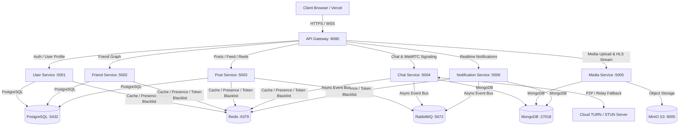

# SocialHub Microservices Platform

> **SocialHub** là nền tảng mạng xã hội hiện đại được xây dựng theo kiến trúc Microservices. Hệ thống hỗ trợ chia sẻ bài viết, tạo Reels video với cơ chế phát luồng HLS mượt mà, quản lý bạn bè, nhắn tin thời gian thực và gọi thoại/video chất lượng cao qua WebRTC tích hợp Cloud TURN Server.

> **Mới bắt đầu với repository này?** Xem [`GETTING_STARTED.md`](GETTING_STARTED.md) để biết hướng dẫn cài đặt, quy trình phát triển và danh sách kiểm tra nộp bài.

---

## 👥 Thành Viên Nhóm (Team Members)

| Họ và Tên | Mã Sinh Viên | Vai Trò | Đóng Góp Chi Tiết |
|-----------|--------------|---------|-------------------|
| Nguyễn Minh Tuấn | - | Fullstack / Microservices Architect | Thiết kế hệ thống, Media Service (HLS Transcoding), Post Service, Chat Service, WebRTC Video Call |
| Nguyễn Văn Khải | - | Fullstack Developer | Phát triển User Service, Friend Service & Giao diện Frontend React |
| Đào Văn Công | - | DevOps Engineer | Quản trị hạ tầng Docker Compose, K8s (GKE Autopilot), CI/CD & Cloud Monitoring |

---

## 🎯 Quy Trình Nghiệp Vụ (Business Process)

Nền tảng **SocialHub** tự động hóa quy trình tương tác xã hội số toàn diện của người dùng:
1. **Quản lý Định danh & Tài khoản**: Người dùng đăng ký, đăng nhập bảo mật qua JWT, cập nhật hồ sơ cá nhân và tìm kiếm người dùng khác.
2. **Mạng lưới Xã hội (Friend Graph)**: Gửi/nhận lời mời kết bạn, chấp nhận/từ chối, gợi ý bạn bè và xem danh sách bạn chung.
3. **Sáng tạo & Phân phối Nội dung**: Tạo bài viết, đăng ảnh/video ngắn (Reels). Hệ thống tự động chuyển mã video sang định dạng HLS (HTTP Live Streaming) bất đồng bộ.
4. **Bảng tin & Tương tác**: Phân phối Feed theo thời gian thực, thả tim (Like), bình luận (Comment), chia sẻ bài viết.
5. **Trò chuyện & Gọi Video thời gian thực**: Nhắn tin cá nhân/nhóm qua Socket.IO, gọi video direct P2P và tự động fallback sang TURN Server (Google Cloud/Oracle) khi bị chặn bởi NAT/Firewall.

---

## 🏗️ Kiến Trúc Hệ Thống (Architecture)

### Sơ đồ kiến trúc tổng quan



### Chi tiết các dịch vụ (Services & Component Specification)

#### Application Services

| Thành Phần (Component) | Vai Trò & Trách Nhiệm (Responsibility) | Công Nghệ (Tech Stack) | Cổng Host (Port) |
|------------------------|---------------------------------------|------------------------|------------------|
| **Frontend** | Giao diện người dùng Web SPA responsive, phát video HLS, Chat UI & Gọi Video WebRTC | React 18, Vite, TailwindCSS, HLS.js, Socket.IO Client | `3000` |
| **API Gateway** | Điểm vào duy nhất (Single Entry Point), Routing, Rate Limiting, CORS, Dynamic Switch Server | Node.js, Express, Http-Proxy-Middleware | `8080` |
| **User Service** | Đăng ký, Đăng nhập, JWT Token, Refresh Token, Quản lý Profile, Tìm kiếm người dùng | Node.js, Express, PostgreSQL, Prisma ORM | `5001` |
| **Friend Service** | Quản lý đồ thị bạn bè, Gửi/nhận lời mời kết bạn, Bạn chung, Gợi ý kết bạn | Node.js, Express, PostgreSQL, Prisma ORM | `5002` |
| **Post Service** | Đăng bài viết, Feed cá nhân/bảng tin, Video Reels, Like, Bình luận, Chia sẻ | Node.js, Express, PostgreSQL, Prisma ORM | `5003` |
| **Chat Service** | Nhắn tin thời gian thực (Cá nhân/Nhóm), Signaling Server cho WebRTC Video Call | Node.js, Express, MongoDB, Mongoose, Socket.IO | `5004` |
| **Media Service** | Tải lên ảnh/video, Transcode HLS bất đồng bộ (FFmpeg), Stream trực tiếp MinIO S3 | Node.js, Express, MinIO S3 SDK, FFmpeg, MongoDB | `5005` |
| **Notification Service** | Phát thông báo tương tác thời gian thực qua Socket.IO, Lưu lịch sử thông báo | Node.js, Express, MongoDB, Mongoose, Socket.IO | `5006` |

#### Infrastructure Services

| Hạ Tầng (Service) | Vai Trò (Role) | Cổng Host (Port) |
|-------------------|---------------|------------------|
| **PostgreSQL 16** | Cơ sở dữ liệu quan hệ lưu trữ thông tin User, Friend, Post, Reel | `5432` |
| **MongoDB 7** | Cơ sở dữ liệu NoSQL lưu trữ tin nhắn Chat, Media Metadata, Notification | `27018` |
| **Redis 7** | Lưu trữ RAM Cache, Trạng thái Online/Offline (Presence), Token Blacklist | `6379` |
| **MinIO S3 (API / Console)** | Trình lưu trữ Object Storage tương thích Amazon S3 cho ảnh & phân đoạn HLS | `9005` / `9001` |
| **RabbitMQ (AMQP / Admin)** | Message Broker trao đổi sự kiện bất đồng bộ giữa các microservices | `5672` / `15672` |

---

## 🚀 Tính Năng & Tối Ưu Nổi Bật (Advanced Technical Highlights)

### 1. Tối ưu hóa HLS Video Streaming & Reels Playback
- **Asynchronous HLS Transcoding**: Upload video phản hồi `201 Created` lập tức sau khi lưu trữ file gốc lên MinIO, quá trình chuyển mã sang HLS (`index.m3u8` & các segment `.ts`) chạy ngầm bất đồng bộ bằng FFmpeg, không gây timeout request.
- **In-Memory Owner Caching (`mediaOwnerCache`)**: Bộ nhớ đệm RAM lưu cặp `mediaId ➔ uploadedBy` giúp truy xuất trực tiếp file phân đoạn `.ts` trên MinIO mà không phải truy vấn lại MongoDB hàng ngàn lần.
- **Client-side Lazy-Loading & Socket Cleanup**: Chỉ nạp HLS playlist và buffering khi Reel card đang hiển thị (`isActive = true`). Tự động hủy thực thể HLS (`hls.destroy()`) và dọn dẹp RAM/Socket khi cuộn trang hoặc unmount player.

### 2. Bảo mật & Quản lý Định danh
- **JWT Dual-Token Rotation & Redis Blacklist**: Quản lý phiên làm việc bằng Access Token (15 phút) và Refresh Token (7 ngày). Tự động vô hiệu hóa token vào Redis Blacklist khi đăng xuất.
- **API Gateway Protection**: Tích hợp Rate Limiting (100 req/min/IP), CORS Range Header, và bảo mật Kubernetes Secrets (mã hóa Base64) hoàn toàn tách biệt khỏi Git repository.

### 3. Tối ưu hóa Chi phí Cloud Operations (Google Cloud Platform)
- **GKE Spot VMs**: Triển khai toàn bộ Pods trên cụm GKE Autopilot sử dụng Node Spot VMs (`cloud.google.com/gke-spot: "true"`) giúp tiết kiệm **60 - 90%** chi phí máy ảo.
- **Cloud Monitoring Log Filtering**: Vô hiệu hóa `console.log/debug` ở môi trường Production, lọc Morgan HTTP Logs (chỉ ghi log lỗi status >= 400) giúp cắt giảm tối đa chi phí Cloud Logging trên GCP.

---

## ⚡ Khởi Động Nhanh (Quick Start)

### 1. Chạy toàn bộ hệ thống bằng Docker Compose (Khuyên dùng)

```bash
# Khởi động toàn bộ hạ tầng & microservices
docker compose up --build -d

# Kiểm tra trạng thái hoạt động của API Gateway
curl http://localhost:8080/health
```

### 2. Chạy từng dịch vụ dưới dạng Local Development

```bash
# Khởi động hạ tầng nền tảng (Postgres, Mongo, Redis, MinIO, RabbitMQ)
docker compose up -d pg mongo redis minio rabbitmq

# Chạy từng service trong các terminal riêng biệt:
cd gateway && npm install && npm run dev
cd services/user-service && npm install && npm run dev
cd services/friend-service && npm install && npm run dev
cd services/post-service && npm install && npm run dev
cd services/chat-service && npm install && npm run dev
cd services/media-service && npm install && npm run dev
cd services/notification-service && npm install && npm run dev
cd frontend && npm install && npm run dev
```

---

## 📡 Chi Tiết REST API & WebSockets

### Swagger UI & Centralized Health Check
- **API Gateway Health Check**: `GET http://localhost:8080/health`
- **Tài liệu Swagger UI tập trung**: `GET http://localhost:8080/api-docs`

### Danh sách Endpoint chính theo Nhóm

#### 🔐 Xác thực & Người dùng (Auth & User)
- `POST /api/auth/register` - Đăng ký tài khoản
- `POST /api/auth/login` - Đăng nhập nhận Access & Refresh Token
- `POST /api/auth/refresh` - Làm mới Token
- `POST /api/auth/logout` - Đăng xuất & Đưa token vào Redis Blacklist
- `GET /api/users/:id` - Xem thông tin người dùng
- `PUT /api/users/:id` - Cập nhật hồ sơ & ảnh đại diện
- `GET /api/users/search` - Tìm kiếm người dùng theo tên

#### 🤝 Bạn bè (Friend Graph)
- `POST /api/friends/request` - Gửi lời mời kết bạn
- `GET /api/friends/requests` - Danh sách lời mời đã nhận
- `PUT /api/friends/requests/:requestId/accept` - Chấp nhận kết bạn
- `PUT /api/friends/requests/:requestId/reject` - Từ chối lời mời
- `GET /api/friends` - Danh sách bạn bè
- `GET /api/friends/suggestions` - Gợi ý kết bạn
- `GET /api/friends/mutual/:userId` - Danh sách bạn chung

#### 📝 Bài viết & Video Reels (Post & Reels)
- `POST /api/posts` | `GET /api/posts/:postId` | `DELETE /api/posts/:postId` - CRUD Bài viết
- `GET /api/feed` - Bảng tin bài viết
- `POST /api/posts/:postId/like` | `DELETE /api/posts/:postId/like` - Tương tác Thích
- `GET /api/posts/:postId/comments` | `POST /api/posts/:postId/comments` - Bình luận bài viết
- `POST /api/reels` | `GET /api/reels` - Đăng và xem danh sách Video Reels (HLS Streaming)
- `POST /api/reels/:id/view` - Tăng số lượt xem Reel
- `POST /api/reels/:id/like` | `GET /api/reels/:id/comments` - Tương tác trên Reel

#### 🖼️ Media & HLS Stream
- `POST /api/media/upload` - Upload ảnh/video (Asynchronous HLS Transcode)
- `GET /api/media/file/:id` - Stream trực tiếp file ảnh/video nguyên bản
- `GET /api/media/hls/:id/index.m3u8` - Stream Playlist Master HLS
- `GET /api/media/hls/:id/:segment` - Stream các phân đoạn `.ts` HLS

#### 💬 Chat, WebRTC & Thông báo Realtime
- WebSocket Chat: `/chat/socket.io/` ➔ Chuyển tiếp tới `chat-service`
- WebSocket Notification: `/notification/socket.io/` ➔ Chuyển tiếp tới `notification-service`
- `GET /api/conversations` | `POST /api/conversations` - Danh sách & tạo cuộc trò chuyện
- `GET /api/conversations/:id/messages` - Lịch sử tin nhắn
- `GET /api/conversations/ice-servers` - Lấy danh sách cấu hình STUN/TURN Server cho Video Call

---

## 📹 Trò Chuyện Video Call & Hướng Dẫn Tối Ưu Hóa (WebRTC & Cloud)

Hệ thống tích hợp tính năng gọi Video/Audio thời gian thực sử dụng WebRTC chuẩn công nghiệp:
- `chat-service` đóng vai trò **Signaling Server** trao đổi thông điệp SDP (Offer/Answer) và ICE Candidates.
- Trình duyệt sẽ cố gắng thiết lập kết nối **Peer-to-Peer (P2P)** trực tiếp giữa 2 người dùng để đạt độ trễ thấp nhất.
- Trong trường hợp 2 máy ở sau NAT nghiêm ngặt/Firewall doanh nghiệp, hệ thống sẽ **tự động chuyển hướng (Relay)** qua **TURN Server** được triển khai trên máy chủ đám mây (Google Cloud / Oracle Cloud).

### Tài liệu hướng dẫn cấu hình chi tiết:
- 📖 [Cấu hình Video Call & TURN Server Detailed Guide](docs/video-call-turn-server.md)
- ☁️ [Hướng dẫn dựng TURN Server trên Google Cloud VM](README_CONFIG_TURN_SERVER_GOOGLE_CLOUD.md)
- ☁️ [Hướng dẫn dựng TURN Server trên Oracle Cloud VM](README_CONFIG_TURN_SERVER_ORACLE.md)
- 🌐 [Deploy Frontend lên Vercel qua Cloudflare Tunnel](README_VERCEL_CLOUDFARE_TUNNEL.md)
- 🌐 [Deploy Frontend lên Vercel qua Ngrok Tunnel](README_VERCEL_NGROK.md)

---

## 📚 Tài Liệu Dự Án (Documentation Index)

| Tài Liệu (Document) | Mô Tả (Description) |
|--------------------|---------------------|
| [`GETTING_STARTED.md`](GETTING_STARTED.md) | Cài đặt môi trường, quy trình phát triển & Danh sách kiểm tra nộp bài |
| [`docs/analysis-and-design-ddd.md`](docs/analysis-and-design-ddd.md) | Phân tích & Thiết kế hệ thống theo phương pháp Domain-Driven Design (DDD) |
| [`docs/architecture.md`](docs/architecture.md) | Kiến trúc hệ thống, các mẫu thiết kế & mô hình triển khai |
| [`docs/api-specs/`](docs/api-specs/) | Thông số tả API chuẩn OpenAPI 3.0 cho từng dịch vụ |
| [`README_GOOGLE_CLOUD_0_ARCHITECTURE.md`](README_GOOGLE_CLOUD_0_ARCHITECTURE.md) | Kiến trúc triển khai Production trên Google Cloud Platform (GCP / GKE) |
